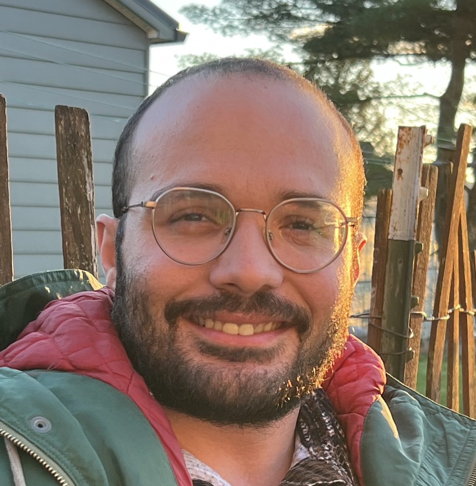

## About Me

I am interested in theoretical computer science with particular focus on quantum computing, optimization and sampling algorithms.

Currently I work as a quantum computing researcher at JPMorgan Chase. 

My [resume](resume.pdf). 

See also: [Google Scholar](https://scholar.google.com/citations?user=SqBr5pYAAAAJ&hl=en), [Linkedin](https://www.linkedin.com/in/guneykan-ozgul/).

E-mail: [guneykanozgul@gmail.com](mailto:@gmail.com)

## Publications and Preprints
1. Quantum Speedups for Group Relaxations of Integer Linear Programs. Brandon Augustino, Dylan Herman, **Guneykan Ozgul**, Jacob Watkins, Atithi Acharya, Enrico Fontana, Junhyung Lyle Kim, Shouvanik Chakrabarti. Preprint 2026.
2. Dylan Herman, **Guneykan Ozgul**, Anuj Apt, Junhyung Lyle Kim, Anupam Prakash, Jiayu Shen, Shouvanik Chakrabarti. Mechanisms for Quantum Advantage in Global Optimization of Nonconvex Functions (QIP 2026, APS 2026).
3. **Guneykan Ozgul**, Xiantao Li, Mehrdad Mahdavi, Chunhao Wang. Quantum Speedups for Sampling and Non-convex Optimization with Stochastic Oracles (TQC 2026).
4. Shouvanik Chakrabarti, Dylan Herman, **Guneykan Ozgul**, Shuchen Zhu, Brandon Augustino, Tianyi Hao, Zichang He, Ruslan Shaydulin, Marco Pistoia. Generalized Short Path Algorithms: Towards Super-Quadratic Speedup over Markov Chain Search for Combinatorial Optimization. (TQC 2025, APS 2025)
5. **Guneykan Ozgul**, Xiantao Li, Mehrdad Mahdavi, Chunhao Wang. Stochastic quantum sampling for non-logconcave distributions and estimating partition functions. (ICML 2024)

## Education
Ph.D. Computer Science and Engineering, Pennsylvania State University, 2021-2025
* Advisors: [Mehrdad Mahdavi](https://www.cse.psu.edu/~mzm616/), [Chunhao Wang](https://www.chunhaowang.com/)
* Dissertation: Quantum Algorithms for Markov Chain Methods In Machine Learning and Optimization ([link](https://etda.libraries.psu.edu/catalog/23460gmo5119))

B.S. Computer Engineering / Physics (Double Major), Boğaziçi University, 2012-2018

