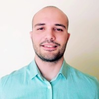

## About Me

I am currently associate quantum computing researcher at JPMorgan Chase & Co..

Previously I received my Ph.D. in Computer Science from Pennsylvania State University.

* Advisors: [Mehrdad Mahdavi](https://www.cse.psu.edu/~mzm616/), [Chunhao Wang](https://www.chunhaowang.com/)

My research focuses on developing both classical and quantum algorithms for large-scale sampling and optimization, with an emphasis on provable performance guarantees.

You can find my CV [here](resume.pdf). 

See also: [Google Scholar](https://scholar.google.com/citations?user=SqBr5pYAAAAJ&hl=en), [Linkedin](https://www.linkedin.com/in/guneykan-ozgul/), [Github](https://github.com/guneykan).

## Research Interests

Optimization, Sampling, Theoretical Computer Science, Quantum Computing

## Publications and Preprints
1. Dylan Herman, **Guneykan Ozgul**, Anuj Apt, Junhyung Lyle Kim, Anupam Prakash, Jiayu Shen, Shouvanik Chakrabarti. Mechanisms for Quantum Advantage in Global Optimization of Nonconvex Functions, 2025. [preprint Arxiv 2510.03385]
2. **Guneykan Ozgul**, Xiantao Li, Mehrdad Mahdavi, Chunhao Wang. Quantum Speedups for Markov Chain Monte Carlo Methods with Application to Optimization, 2025. [preprint Arxiv 2504.03626]
3. Shouvanik Chakrabarti, Dylan Herman, **Guneykan Ozgul**, Shuchen Zhu, Brandon Augustino, Tianyi Hao, Zichang He, Ruslan Shaydulin, Marco Pistoia. Generalized Short Path Algorithms: Towards Super-Quadratic Speedup over Markov Chain Search for Combinatorial Optimization. [TQC 2025]
4. **Guneykan Ozgul**, Xiantao Li, Mehrdad Mahdavi, Chunhao Wang. Stochastic quantum sampling for non-logconcave distributions and estimating partition functions. [ICML 2024]

## Education
Ph.D. Computer Science and Engineering, Pennsylvania State University, 2021-2025
Dissertation: Quantum Algorithms for Markov Chain Methods In Machine Learning and Optimization ([link](https://etda.libraries.psu.edu/catalog/23460gmo5119))

B.S. Computer Engineering / Physics, Boğaziçi University, 2012-2018

## Teaching 

* CMPSC 448 (Machine Learning and Algorithmic AI), Spring 2023, TA

* CMPSC 497 (Introduction to Quantum Computing), Fall 2022, TA 

* CMPSC 448 (Machine Learning and Algorithmic AI), Spring 2022, TA
 
* CMPSC 497 (Introduction to Quantum Computing), Fall 2021, TA
